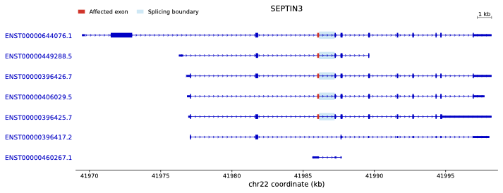
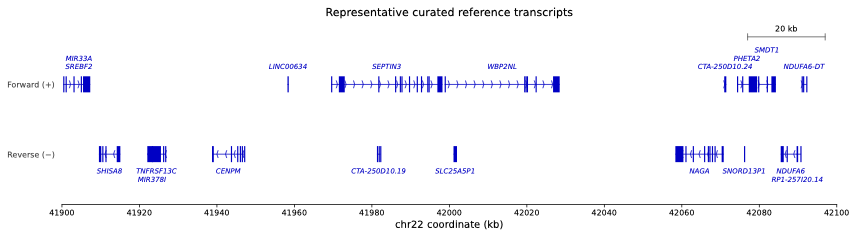

# GTF Isoform Plotter

> **Notice:** This software was generated with assistance from OpenAI Codex.
> Review the source code and validate all plots against the original annotation
> data before publication or downstream analysis. It is provided without
> warranty.

Create publication-ready transcript isoform diagrams from GTF annotations. The
output is an editable PDF: transcript labels remain text, and exons, introns,
strand chevrons, axes, highlights, and scale bars remain vector objects in
Adobe Illustrator.

## 1. Features

- Reads standard `.gtf` and gzip-compressed `.gtf.gz` files.
- Selects genes by `gene_name` or `gene_id`.
- Accepts one gene or a comma-separated gene list.
- Accepts a tab-separated gene table with optional per-gene splice annotations.
- Draws every transcript isoform from top to bottom.
- Labels isoforms with stable GTF `transcript_id` accessions such as `ENST...`.
- Distinguishes narrow UTR/noncoding exon segments from taller CDS segments.
- Writes one PDF page per gene when multiple genes are requested.
- Draws a reference-gene track with one representative transcript per gene in a region.
- Shows strand direction with fine genome-browser-style chevrons.
- Uses one uniform, coordinate-aligned chevron spacing across every model on a plot.
- Displays coordinates in kb or Mb.
- Optionally highlights affected exons in red and splice boundaries in light blue.
- Allows ±2 bp exon-coordinate differences by default.
- Flags transcript-only GTF records with orange hatched blocks and a warning legend.

## 2. Installation

Python 3.9 or newer is required.

### 2.1 pip

```bash
cd gtf-isoform-plotter
python3 -m venv .venv
source .venv/bin/activate
python -m pip install --upgrade pip
python -m pip install .
```

For an editable development installation:

```bash
python -m pip install -e ".[dev]"
```

### 2.2 Conda

```bash
conda env create -f environment.yml
conda activate gtf-isoform-plotter
```

## 3. Plotting modes

The program provides two deliberately separate workflows:

- `--plot-type isoforms`: plot every isoform for one or more named genes.
- `--plot-type reference`: plot one representative curated/canonical transcript
  per gene across a chromosome interval.

The default is `--plot-type isoforms`.

### 3.1 Isoform mode

Plot all isoforms of one gene:

```bash
gtf-isoform-plotter \
  --gtf-file gencode.v38.annotation.gtf.gz \
  --plot-type isoforms \
  --genes SEPTIN3 \
  --unit kb \
  --output SEPTIN3_isoforms.pdf
```

Plot several genes. The resulting PDF has one editable page per gene:

```bash
gtf-isoform-plotter \
  --gtf-file gencode.v38.annotation.gtf.gz \
  --plot-type isoforms \
  --genes SEPTIN3,DGKZ,PAK6 \
  --unit Mb \
  --output selected_genes.pdf
```

Gene IDs are also accepted:

```bash
gtf-isoform-plotter \
  --gtf-file annotation.gtf.gz \
  --plot-type isoforms \
  --genes ENSG00000100167.19 \
  --output SEPTIN3_by_gene_id.pdf
```

#### 3.1.1 Example output

The preview below is rendered from the editable PDF produced by isoform mode.
Click the image to open or download the original vector PDF.

[](docs/examples/isoform_example.pdf)

#### 3.1.2 Selecting genes with `--gene-file`

Instead of `--genes`, isoform mode can read genes and optional per-gene splice
annotations from a tab-separated file:

```bash
gtf-isoform-plotter \
  --gtf-file gencode.v38.annotation.gtf.gz \
  --plot-type isoforms \
  --gene-file genes_and_splicing.tsv \
  --unit kb \
  --output selected_isoforms.pdf
```

The table accepts one to three columns:

```text
gene       affected_exon       splicing_boundary
SEPTIN3    41985984,41986112    41986112,41987206
DGKZ       31725925,31726084
PAK6
```

The columns must be separated by tabs:

1. **Gene name or gene ID — required.** All isoforms of this gene are plotted.
2. **Affected exon coordinates — optional.** A matching exon is colored red.
3. **Splicing-boundary coordinates — optional.** The boundary is shaded light
   blue. Column 3 can only be used when column 2 is present.

A row containing only a gene name produces an ordinary isoform plot without
highlighting. A two-column row highlights the affected exon but does not draw a
boundary. A three-column row draws both annotations. Repeat a gene on additional
rows to annotate multiple affected exons:

```text
SEPTIN3    41985984,41986112    41986112,41987206
SEPTIN3    41987206,41987287    41987287,41987622
```

The gene is plotted once, with both events applied. Gene order follows the first
appearance of each gene in the file. A header is optional, and blank lines and
lines beginning with `#` are ignored.

Use exactly one of `--genes` or `--gene-file` in isoform mode. The original
global `--splice-file` can still be used; if both `--gene-file` annotations and
`--splice-file` are supplied, their annotations are combined.

The uninstalled compatibility launcher can be used from the repository root:

```bash
python plot_transcript.py \
  --gtf-file annotation.gtf.gz \
  --plot-type isoforms \
  --genes SEPTIN3
```

#### 3.1.3 UTR and CDS display

In isoform mode, exon height follows the standard genome-browser convention:

```text
UTR / noncoding exon       ━━━
CDS                       █████
```

The plotter first draws each complete exon as a narrow box, then overlays the
GTF `CDS` intervals as taller boxes. Consequently, the narrow portions before,
after, or between CDS intervals represent untranslated exonic sequence.

```text
5′ UTR       CDS                    3′ UTR
━━━━━━████████████████████████████━━━
```

This display depends on the annotation records in the input:

- GTFs containing both `exon` and `CDS` features show narrow UTRs and tall CDS.
- Noncoding transcripts with exon records but no CDS remain narrow.
- If a GTF omits CDS records, the plotter does not attempt to infer coding
  boundaries; all known exon segments remain narrow.
- Transcript-only records with no exon features retain the orange hatched
  warning style instead.

When splice highlighting matches an affected exon, both its narrow UTR portion
and any tall CDS portion are colored red.

### 3.2 Reference-region mode

Reference mode produces a UCSC-like gene track across a chromosome range. It
shows all genes overlapping the range but selects only one representative
transcript for each gene:

```bash
gtf-isoform-plotter \
  --gtf-file gencode.v38.annotation.gtf.gz \
  --plot-type reference \
  --region chr22:41900000-42100000 \
  --unit Mb \
  --output chr22_reference_genes.pdf
```

Commas are accepted in region coordinates:

```bash
--region chr22:41,900,000-42,100,000
```

#### 3.2.1 Example output

The preview below shows the two-row reference layout: forward genes are on the
top row, reverse genes are on the bottom row, and gene labels are staggered to
reduce collisions. Click the image to open or download the original editable
vector PDF.

[](docs/examples/reference_example.pdf)

The representative is selected in this priority order:

1. Curated RefSeq accessions beginning with `NM_` or `NR_`
2. GENCODE `MANE_Select` transcripts
3. `Ensembl_canonical` transcripts
4. Transcripts tagged `basic`
5. The longest available transcript

The exact candidates depend on the annotations present in the supplied GTF.
For a GENCODE GTF, MANE Select or Ensembl canonical will commonly be selected.
For a RefSeq GTF, an `NM_` or `NR_` accession will be preferred.

Reference structures are arranged in two strand-specific rows:

- Forward-transcribed (`+`) genes are shown in the top row.
- Reverse-transcribed (`−`) genes are shown in the bottom row.

Gene names are placed immediately above forward models and below reverse
models. Nearby names are automatically staggered into label lanes to reduce
overlap while the gene structures remain in two rows. A scale bar is added at
the upper right and automatically uses an appropriate length expressed in the
selected `--unit` (`kb` or `Mb`).

#### 3.2.2 How representative transcripts and exons are selected

Reference mode does **not** select individual exons from different transcripts.
It first chooses one complete representative transcript for each gene and then
uses the exon records belonging to that transcript.

The process is:

```text
Find genes overlapping --region
        ↓
Collect their candidate transcripts
        ↓
Rank transcripts using RefSeq/MANE/canonical/basic/length priority
        ↓
Choose one representative transcript per gene
        ↓
Plot all exons from that transcript that overlap the requested region
```

For example, suppose the selected transcript has these exon records:

```text
Exon 1: 41,976,934–41,977,074
Exon 2: 41,981,645–41,981,836
Exon 3: 41,985,984–41,986,112
```

All three exons are drawn if they overlap `--region`. The program does not pick
only one exon, and it does not combine exon 1 from one isoform with exon 2 from
another isoform.

The chromosome interval controls the visible plotting window:

- Exons completely inside the interval are shown in full.
- Exons crossing an interval boundary are clipped visually at the plot edge.
- Exons completely outside the interval are not shown.
- The longest-transcript fallback uses the full transcript start/end bounds
  when the GTF supplies a `transcript` record, not just the visible exons.

The representative transcript ID is determined from the supplied GTF metadata.
Changing the GTF release or annotation provider can therefore change which
transcript is selected.

## 4. Optional splice highlighting

`--splice-file` is optional. If it is omitted, the plot is created without red
or light-blue annotations.

The splice file contains two **tab-separated** columns. Each column contains a
comma-separated coordinate pair:

```text
# affected_exon        splicing_boundary
41985984, 41986112     41986112, 41987206
```

The first column is matched to exon start/end coordinates in the GTF. Both ends
must match, with a default tolerance of ±2 bp. The matching exon is colored red.
The range in the second column is shaded light blue on each matching transcript.

```bash
gtf-isoform-plotter \
  --gtf-file gencode.v38.annotation.gtf.gz \
  --plot-type isoforms \
  --genes SEPTIN3 \
  --splice-file SEPTIN3_splice.txt \
  --splice-tolerance 2 \
  --output SEPTIN3_splice.pdf
```

Use `--splice-tolerance 0` to require exact matches.

## 5. Command-line options

```text
--gtf-file PATH          Input .gtf or .gtf.gz file (required)
--plot-type TYPE         isoforms or reference [isoforms]
--genes NAMES            Gene name/ID list; required in isoforms mode
--gene-file PATH         Gene TSV with optional exon/boundary columns
--region REGION           chrom:start-end; required in reference mode
-o, --output PATH        Editable PDF output [transcript_isoforms.pdf]
--unit {kb,Mb}           Coordinate unit [kb]
--splice-file PATH       Optional splice annotation file
--splice-tolerance BP    Exon matching tolerance [2]
```

## 6. GTF requirements and behavior

The parser uses `gene_name` or `gene_id`, `transcript_id`, chromosome, strand,
and exon coordinates from standard 9-column GTF records. Full exon–intron
models require `exon` features. If a selected transcript has only a `transcript`
feature, its span is drawn as a single block because individual exon boundaries
are not present in the source file.

### 6.1 Why missing exon records matter

A transcript record supplies only the outer boundaries:

```text
chr1  source  transcript  131125  135623  .  +  .  transcript_id "TX1";
```

From this line, the program knows only:

```text
131125  ━━━━━━━━━━━━━━━━━━━━━━━━━━━━━━━━━  135623
        complete transcript span
```

It cannot tell whether the true structure is:

```text
131125  █████────████──────█████████████  135623
```

or:

```text
131125  ███────────────████──────────████  135623
```

Both possibilities have the same transcript start and end. A complete GTF adds
individual exon records:

```text
chr22  source  transcript  100  900  .  +  .  transcript_id "TX1";
chr22  source  exon        100  200  .  +  .  transcript_id "TX1";
chr22  source  exon        400  500  .  +  .  transcript_id "TX1";
chr22  source  exon        700  900  .  +  .  transcript_id "TX1";
```

This permits a real exon–intron model:

```text
100  █████──────█████──────██████████  900
     exon       exon       exon
```

To prevent a transcript span from being mistaken for a known single-exon
structure, the plotter uses two visually distinct styles:

- **Blue blocks:** exon coordinates were present in the GTF.
- **Orange hatched blocks:** only a transcript span was available; exon
  boundaries are unknown.

Orange tracks also produce a legend reading
`Transcript span only (exons unavailable)`.

For example, `gencode.v38.2wayconspseudos.gtf.gz` distributed with GENCODE v38
contains transcript spans but no exon features. It can be plotted, but it cannot
provide multi-exon structures that are absent from the file. These records will
therefore appear orange and hatched in both plot modes.

## 7. Editable PDF output

PDF fonts are embedded as TrueType (font type 42). Illustrator can edit the
labels as text and ungroup/edit all graphical elements as vectors. No raster
image is embedded by the plotter.

## 8. TODO

- Add reference-track biotype classification using GTF attributes such as
  `gene_type` and `gene_biotype`.
- Add distinct, color-blind-accessible styles for protein-coding genes,
  pseudogenes, miRNAs, lncRNAs, and other noncoding RNA classes.
- Add a reference-mode legend explaining the displayed gene classes.
- Add command-line filters for including or excluding selected biotypes, for
  example `--include-biotypes protein_coding,miRNA` or
  `--exclude-biotypes pseudogene`.
- Define documented fallback behavior for GTF files that do not provide a gene
  biotype attribute.

## 9. Testing

```bash
python -m pytest
```

## 10. Repository layout

```text
transcript_isoform_plotter/
  cli.py       Command-line interface
  gtf.py       Plain/gzipped GTF parsing
  plotting.py  Editable vector PDF rendering
  splice.py    Splice annotation parsing and matching
tests/         Automated tests
examples/      Example gene table
docs/images/   README previews rendered from the example PDFs
docs/examples/ Editable PDF examples linked from the README
pyproject.toml Python packaging and dependencies
environment.yml Conda environment
```

## 11. License

MIT
